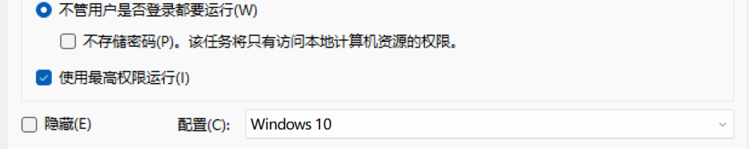
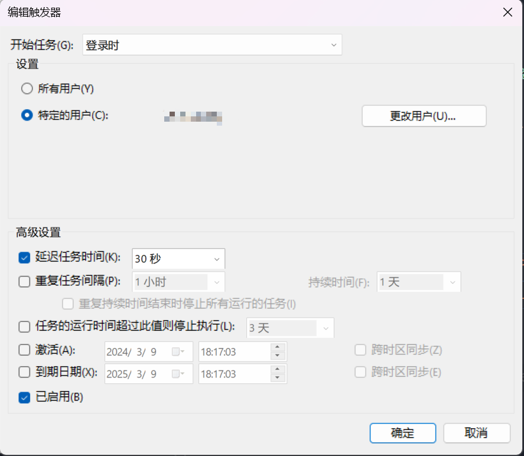
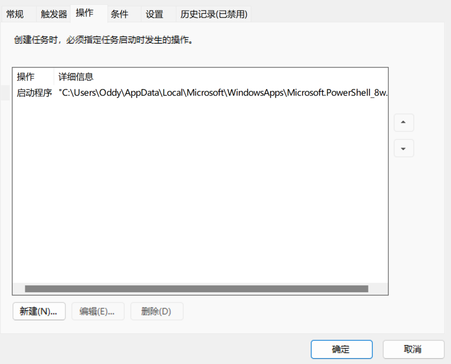
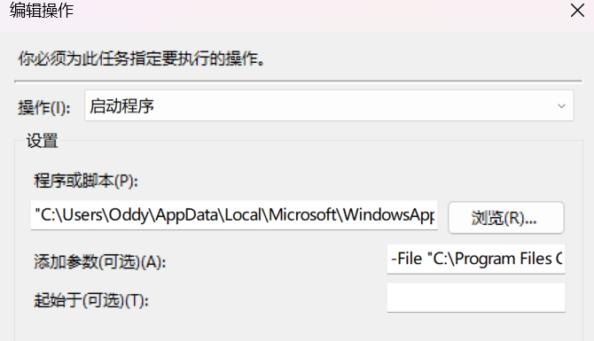
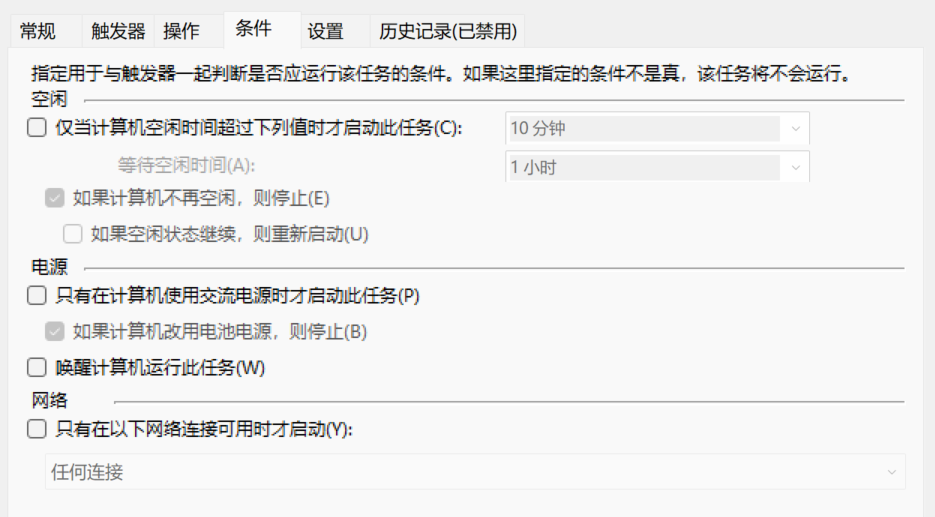
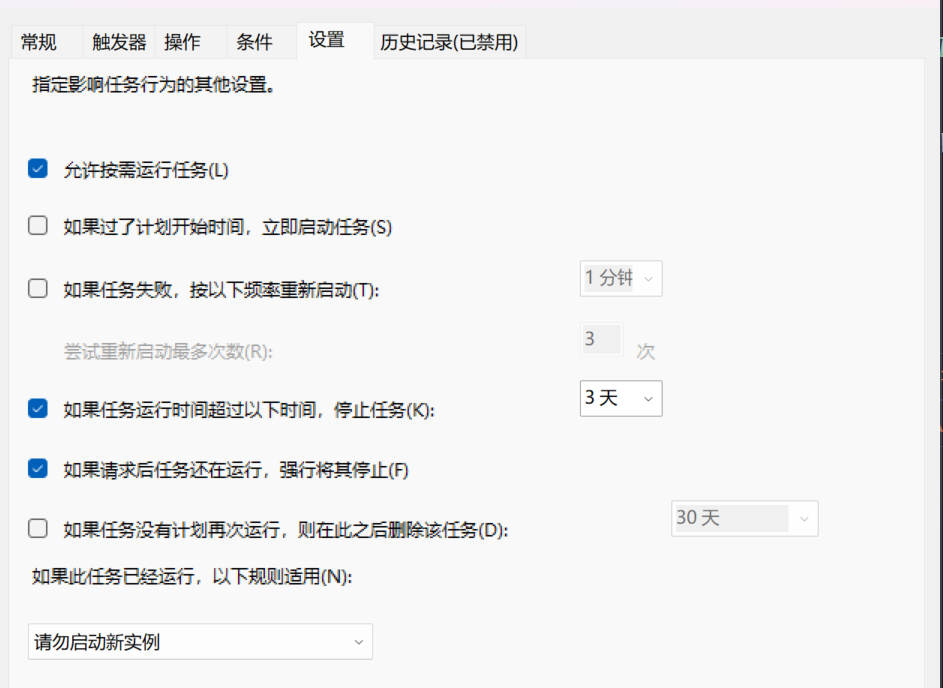

<!-- Title -->

   <h1>小工具</h1>
   <h4>一些自动化小工具。</h4>
   

      
      
   

   

      <a href="#注意">注意</a> •
      <a href="#许可">许可</a>
   

<!-- Table of Contents -->

   
目录

   <ol>
      <li>
         <a href="#acl-自动化校园生活">ACL 自动化校园生活</a>
      </li>
      <li><a href="#注意">注意</a></li>
      <li><a href="#许可">许可</a></li>
   </ol>

<!-- ACL -->
## ACL 自动化校园生活

> 关键词：校园网、台式机、远程控制、监控 IP 变化

### 描述

Windows 平台下基于任务计划程序实现的开机自动登陆校园网工具，若校园网 IP 变更，还能自动向指定邮箱发送邮件。主要适用于校园环境下的台式机场景，且常有远程控制的需求。

### 使用方式

1. 将你的电脑连接网线，打开浏览器的 `开发者工具 -> 网络` 选项，并进行一次正常登录
2. 新建配置 `config.txt` 文件于 `bin\acl\login-campus\` 目录下，将抓取的信息填入其中
3. 创建 Windows 任务计划，配置如下：

   
   
   
   
   
   
   其中，为实现无窗口允许脚本，编辑操作中的“程序或脚本”应为 PowerShell 7 的安装路径 `"C:\Users\<你的用户名>\AppData\Local\Microsoft\WindowsApps\Microsoft.PowerShell_8wekyb3d8bbwe\pwsh.exe"`，参数为代理脚本路径 `-File "<本工具所在路径>\acl.ps1"`。

（<a href="#readme-top">返回顶部</a>）

## 注意

1. 所有小工具均基于 PowerShell 开发，仅保证支持 Windows 平台
2. 如果脚本执行失败，可能需要安装新版 PowerShell。最便捷的安装方式是直接从 Microsoft Store 中安装，无需其他操作。其他安装方式和安装有关事项见[官方提供的安装教程](https://learn.microsoft.com/zh-cn/powershell/scripting/install/installing-powershell-on-windows?view=powershell-7.3)
3. 如果出现拒绝执行脚本之类的提示，请使用 `Set-ExecutionPolicy RemoteSigned` 命令将计算机上的执行策略更改为 RemoteSigned。有关 `Set-ExecutionPolicy` 命令的内容见[官方教程](https://learn.microsoft.com/zh-cn/powershell/module/microsoft.powershell.security/set-executionpolicy?view=powershell-7.3)。有关该问题的原因等请自己百度

（<a href="#readme-top">返回顶部</a>）

## 许可

[MIT](LICENSE).

（<a href="#readme-top">返回顶部</a>）

