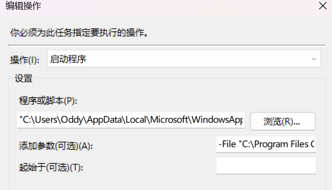
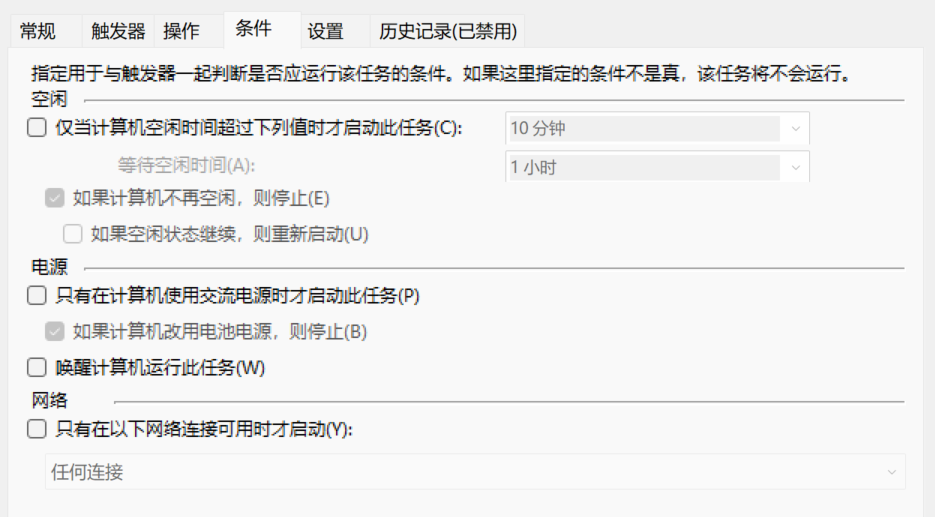
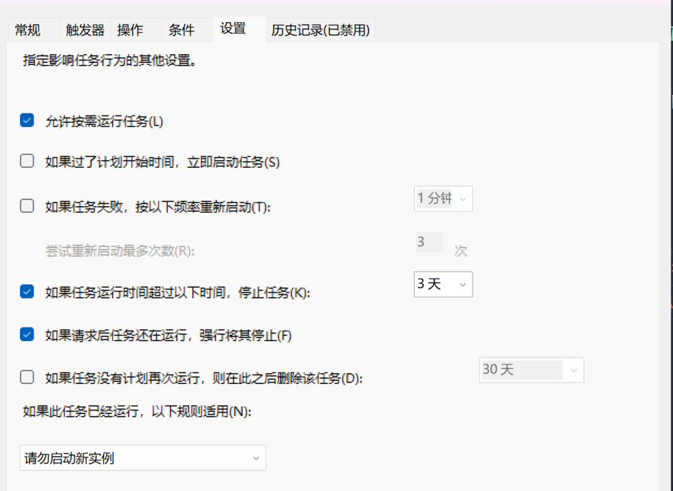

# Small Tools

Some small tools.

## ACL Auto Campus Life

> Keywords: Campus Network, PC, Remote Control, Monitoring IP changes

The tool of automatic login to campus network based on Task Scheduler under Windows platform can automatically send mail to the designated mailbox if the IP of campus network changes.
It is mainly suitable for desktop airport view in campus environment, and there is often the need for remote control.

### Usage

1. Connect your computer to the network cable, open the browser's `Developer Tools-> Network ` tab, and log in normally
2. Create a new configuration file `config.txt` in the `bin\acl\login-campus\` directory and fill it with the crawled information.
3. Create a Windows task schedule with the following configuration:
   
   
   
   
   
   
   In order to allow scripts without windows, "program or script" in the editing operation should be the installation path of PowerShell 7 `"C:\Users\<YourUserName>\AppData\Local\Microsoft\WindowsApps\Microsoft.PowerShell_8wekyb3d8bbwe\pwsh.exe"`, and the parameter is the agent script path `-File "<PathOfThisTool>\acl.ps1"`。

## Notice

1. Only Windows platforms are supported.
2. If the script fails, you may need to install PowerShell 7. The easiest way to install is to install directly from Microsoft Store, without further action. For other installation methods and installation-related matters, see [official installation tutorial](https://learn.microsoft.com/zh-cn/powershell/scripting/install/installing-powershell-on-windows?view=powershell-7.3).
3. If you are prompted to refuse to execute a script, use the `Set-ExecutionPolicy RemoteSigned` command to change the execution policy on your computer to RemoteSigned. For information about the `Set-ExecutionPolicy` command, see [here](https://learn.microsoft.com/zh-cn/powershell/module/microsoft.powershell.security/set-executionpolicy?view=powershell-7.3). Please direct Google for the cause of the problem.
